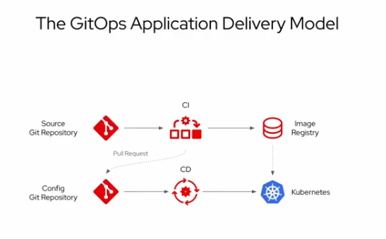

GitOps exploration
=====================
GitOps is a declarative approach to **continuous delivery** that uses Git as the single source of truth for everything (infrastructure and application)

Concepts & Architecture
=====================
Argo CD automates the deployment of the desired application states (yaml,kustomize,helm, ...) in the specified target environments (kubernetes clusters) and keep them synchronized 

The main concept is the **application** (CRD) that defines the source of the manifests to deploy (path in a Git repositoy), the destination to deploy to (kubernetes cluster namespace) and the sync options\

Application can be grouped by **projects**.

About Openshift GitOps
=====================
**Openshift GitOps** is RedHat implementation framework for GitOps, built on **Argo CD** (CNCF project)

Installing Openshift GitOps
=====================
- Openshift GitOps is available as an operator (**Red Hat OpenShift GitOps**) in the OperatorHub

- Installing the operator will create a default ArgoCD instance and a default project in the openshift-gitops namespace.

- use oc command to obtain ArgoCD console pasword:\
`oc extract secret/openshift-gitops-cluster -n openshift-gitops --to=-`

- open the ArgoCD console in your browser:\
(you can use the menu link that was added by the operator on top of OCP console)

Simple use cases
=====================

Pre-req
---------------------------
- fork and then clone the current repository in your environment
  - argo folders contain the descriptions of the various Argo CRD (applications and projects)
  - config folders contain everything related to OCP platform configuration
  - apps folders contain everything needed to deploy applications

UC1: Add a link to the OCP Console
---------------------------
- look at [cluster-configs.yaml](./argo-crd/config/console/console-link.yaml) that defines the sources (yaml manifests) and destination (ocp cluster)

- create a new ArcoCD application from this file\
`cd gitops; oc apply -f argo-crd/config/console/console-link.yaml`

- look at the new Application in ArgoCD console.\
It's status should be Out Of Sync, because the target resources don't exist yet and the synchronization mode is Manual

- sync the application using the Sync button and wait for the Synced status.\
Then verifiy that a new link to ARgoCd documentation is added to the OCP console

UC2: Deploy a simple application (petclinic)
---------------------------
- look at  [PetClinicArgoApp.yml](./argo/apps-def/PetClinic/PetClinicArgoApp.yml) that defines the sources (yaml manifests) and destination (ocp cluster)

- create a new ArcoCD application from this file\
`cd gitops; oc apply -f argo/apps-def/PetClinic/PetClinicArgoApp.yml`

- look at the new Application in ArgoCD console.\
For this application the Sync mode is automatic so you don't have to use the Sync button

- wait for the application to sync and watch the resources creation from the ArgoCD console

- find the route in the new namespace and test the application

- try to scale the application and observe that ArgoCD synchronize the application back to the stage defined in Git

UC3: Add rook-ceph storage to the cluster
---------------------------
- look at [cephApp.yml](./argo-crd/config/ceph/cephApp.yml):\
this file defines a Application CRD for ArgoCD, that will use the content of ./argo-crd/config/ceph/ folder (yaml manifests) to create and synchronize resources in the current OCP cluster

- create a new ArcoCD application from a yaml file\
`cd gitops; oc apply -f argo-crd/ceph/cephApp.yml`

- sync the new application

- wait for the sync to terminate and observe the new resources from the console

Deploy in a several environments, avoiding yaml duplication (Kustomize)
---------------------------

IBM implementation for deploying Cloud Paks
---------------------------

Challenges
=====================
secrets managements\
security\
order dependent deployments\
objects manualy added and not described in app are not sync
