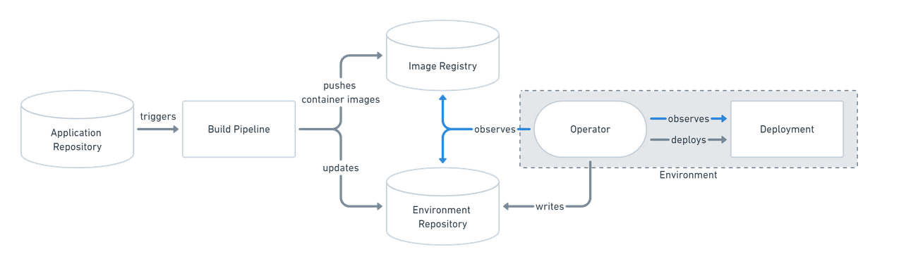
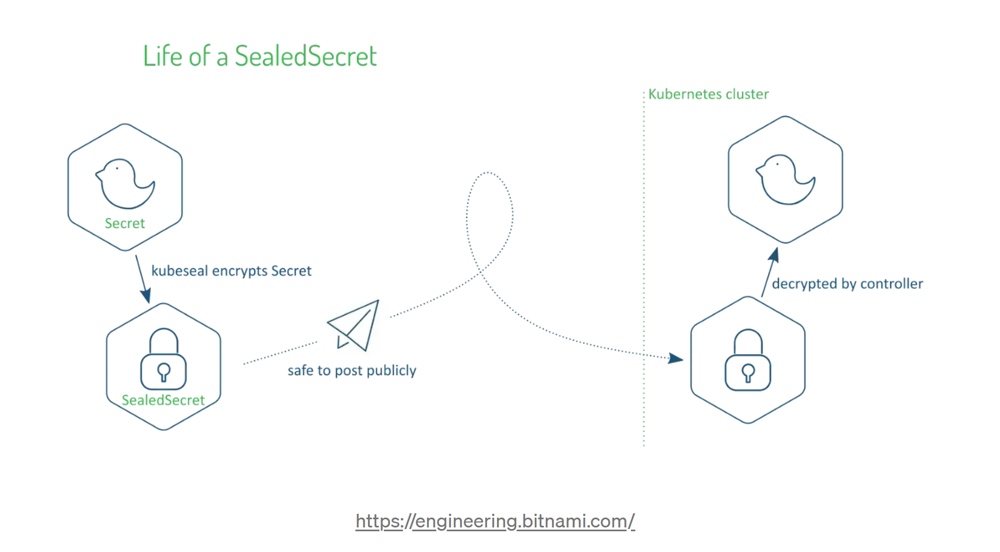

<center>GitOps exploration</center>
=====================

TOC:
=====================
- [Installing Openshift Gitops](https://github.com/gitops-jml/gitops-with-argocd#installing-openshift-gitops)
- [Simple Use Cases](https://github.com/gitops-jml/gitops-with-argocd#simple-use-cases-labs)
  - [PreReq](https://github.com/gitops-jml/gitops-with-argocd#pre-req)
  - [UC1: add a link to OCP console](https://github.com/gitops-jml/gitops-with-argocd#uc1-add-a-link-to-the-ocp-console)
  - [UC2: add a banner to OCP console](https://github.com/gitops-jml/gitops-with-argocd#uc2-add-a-banner-to-the-ocp-console)
  - [UC3: deploy a simple application](https://github.com/gitops-jml/gitops-with-argocd#uc3-deploy-a-simple-application-petclinic)
  - [UC4a: use sealed secrets](https://github.com/gitops-jmlgitops-with-argocd#uc4a-use-sealed-secrets-to-store-the-secrets--need-to-be-competed-)
  - [UC4b: use IBM Secret Manager](https://github.com/gitops-jml/gitops-with-argocd#uc4b-use-ibm-secret-manager-to-store-the-secrets-ibm-cloud)
  - [UC5: Deploy in several environments (Kustomize)](https://github.com/gitops-jml/gitops-with-argocd#uc5-deploy-in-several-environments-avoiding-yaml-duplication-kustomize)
  - [UC6: IBM implementation for deploying software (APIC)](https://github.com/gitops-jml/gitops-with-argocd#uc6-ibm-implementation-for-deploying-software-apic-with-argocd-and-configuring-it-with-tekton)


About GitOps
=====================
GitOps is a declarative approach to **continuous delivery** that uses Git as the single source of truth for everything (infrastructure and application)




About Openshift GitOps
=====================
**Openshift GitOps** is RedHat implementation framework for GitOps, built on **Argo CD** (CNCF project)

Concepts & Architecture
=====================
Argo CD automates the deployment of the desired application states defined as manifests (yaml,kustomize,helm, ...) to the specified target environments (kubernetes clusters) and keep them synchronized 

The main concept is the **application** (CRD) that defines the source of the manifests to deploy (path in a Git repositoy), the destination to deploy to (kubernetes cluster namespace) and the sync options (manual or automatic)

Application can be grouped by **projects**.


Installing Openshift GitOps
=====================
- Openshift GitOps is available as an operator (**Red Hat OpenShift GitOps**) in the OperatorHub


- Installing the operator will create a default ArgoCD instance and a default project in the **openshift-gitops namespace.**


- use oc command to obtain ArgoCD console pasword:\
`oc extract secret/openshift-gitops-cluster -n openshift-gitops --to=-`

- open the ArgoCD console in your browser:\
(you can use the menu link that was added by the operator on top of OCP console)


Simple use cases (Labs)
=====================

Pre-req
---------------------------
- fork and then clone the current repository in your environment
  `git clone https://github.com/gitops-jml/gitops-with-argocd.git GitRepos`

In this repository:
  - argo folders contain the descriptions of the various Argo CRD (applications and projects)
  - config folders contain everything related to OCP platform configuration
  - apps folders contain everything needed to deploy applications
  


UC1: Add a link to the OCP Console
---------------------------
- look at [console-link.yaml](./argo-crd/config/console/console-link.yaml) that describes **what** to deploy (yaml manifests) and **where** (ocp cluster and namespace)


- create a new ArcoCD application from this file\
`cd ; oc apply -f GitRepos/gitops-with-argocd/argo-crd/config/console/console-link.yaml`

- look at the new Application in ArgoCD console.\
It's status should be Out Of Sync, because the target resources don't exist yet and the synchronization mode is Manual


- sync the application using the Sync button and wait for the Synced status.\
Then verifiy that a new link to ARgoCd documentation is added to the OCP console


UC2: Add a banner to the OCP Console
---------------------------

- create a new ArcoCD application from this file\
`cd ; oc apply -f GitRepos/gitops-with-argocd/argo-crd/config/console-banner/console-banner.yaml`

- look at the new Application in ArgoCD console.\
  Sync is automatic for this new application. Wait for the synced status and verifiy that a new banner is added to the OCP console

UC3: Deploy a simple application (petclinic)
---------------------------
- look at  [PetClinicArgoApp.yaml](./argo-crd/apps/PetClinic/PetClinicArgoApp.yaml) that defines the sources (yaml manifests) and destination (ocp cluster and namespace)

- create a new ArcoCD application from this file\
`cd ; oc apply -f GitRepos/gitops-with-argocd/argo-crd/apps/PetClinic/PetClinicArgoApp.yaml`

- look at the new Application in ArgoCD console.\
For this application the Sync mode is automatic so you don't have to use the Sync button


- wait for the application to sync and watch the resources creation from the ArgoCD console


- find the route in the new namespace and test the application


- try to scale the application and observe that ArgoCD synchronize the application back to the stage defined in Git

UC4a: Use sealed secrets to store the secrets ( NEED TO BE COMPETED )
---------------------------



- deploy the controler: TBD
  
- install kubeseal: 
```
wget https://github.com/bitnami-labs/sealed-secrets/releases/download/v0.19.2/kubeseal-0.19.2-linux-amd64.tar.gz
tar -xvzf kubeseal-0.19.2-linux-amd64.tar.gz
sudo install -m 755 kubeseal /usr/local/bin/kubeseal
```
- create a sealed secret:
```
echo -n mysecretword | kubectl create secret generic mysecret --dry-run=client --from-file=foo=/dev/stdin -o json \
 | kubeseal  --controller-name sealed-secrets --controller-namespace sealed-secrets -  >mysealedsecret.json
```
- create a secret from the sealed secret
```
oc apply -f mysealedsecret.json
```
- check that a new sealed-secret has been created in default namespace, with encrypted data
```
oc get sealedsecret/mysecret -o yaml -n default
```
- check that a new secret has been created in the default namespace with the value mysecretword (base64 encoded) and teh sealed secret as owner reference
```
# oc get secret/mysecret -o yaml -n default
apiVersion: v1
data:
  foo: bXlzZWNyZXR3b3Jk
kind: Secret
metadata:
  name: mysecret
  namespace: default
  ownerReferences:
  - apiVersion: bitnami.com/v1alpha1
    controller: true
    kind: SealedSecret
    name: mysecret
    uid: aae5fef5-9956-4b6f-831f-ca7b8e89b864
type: Opaque

# oc extract secret/mysecret -n default
foo
# more foo
mysecretword
```

UC4b: Use IBM Secret Manager to store the secrets (IBM Cloud)
---------------------------
References:
- https://external-secrets.io/v0.7.0/introduction/overview/
- https://external-secrets.io/v0.7.1/provider/ibm-secrets-manager/
  
Additional Pre-requisites:
- A valid openshift cluster in IBM Cloud
- A valid secret manager instance in your IBM Cloud account ( a free one can be used during a month)\
  see: https://cloud.ibm.com/docs/secrets-manager?topic=secrets-manager-create-instance&interface=ui

- a valid IBM Cloud API key\
  see: https://cloud.ibm.com/iam/apikeys to create the key

  
Framework:
The mecanism is quite the same as with sealed secrets: an operator will regularly watch custom resources defining
- where the secrets are kept (CRD secretStore)
- what are the desired secrets (CR ExternalSecret)
  
and create the real secrets in the cluster as specified in each ExternalSecret instance

Usefull commands:
  ```
  # log in IBM Cloud with your api key
  ibmcloud login --apikey <your api key>
  # retrieve your secret manager ID
  ibmcloud resource service-instance '<your secret manager name>' --output JSON | jq -r '.[0].crn'
  # retrieve your secret manager endpoint
  ibmcloud resource service-instance '<your secret manager name>' --output JSON | jq -r '.[].dashboard_url | .[0:-3]'
  # retrieve your secret groups
  ibmcloud secrets-manager secret-groups --service-url https://<your secret manager ID>.eu-de.secrets-manager.appdomain.cloud
  # create a secret
  ibmcloud secrets-manager secret-create --secret-type username_password  --resources '[{"name":"mysecret","description":"description for my secret.","username":"user1","password":"mysecret password","labels":["my-test-cluster","tutorial"]}]' --service-url https://<your secret manager ID>.eu-de.secrets-manager.appdomain.cloud
  # retrieve your secrets
  ibmcloud secrets-manager secrets --secret-type  username_password --service-url https://<your secret manager ID>.eu-de.secrets-manager.appdomain.cloud
  ```

Steps:
- create a new secret (user credential type) in your instance of Secret Manager\
  see: https://cloud.ibm.com/docs/secrets-manager?topic=secrets-manager-user-credentials&interface=ui
- create a new project to experiment
  ```
  oc new-project external-secrets
  ```
  create a secret from your API key (used to access Secret Manager)
  ```
  oc create secret generic secret-api-key --from-literal=apiKey=<yourkey> -n external-secrets
  ```
- The operator can be installed "manually" using the following subscription and OperatorConfig, or by ArgoCD (see further):
  ```
  apiVersion: operators.coreos.com/v1alpha1
  kind: Subscription
  metadata:
    name: external-secrets-operator
    namespace: openshift-operators
  spec:
    channel: alpha
    installPlanApproval: Automatic
    name: external-secrets-operator
    source: community-operators
    sourceNamespace: openshift-marketplace
    startingCSV: external-secrets-operator.v0.7.2
  ---
  apiVersion: operator.external-secrets.io/v1alpha1
  kind: OperatorConfig
  metadata:
    name: cluster
    namespace: openshift-operators
  spec:
    prometheus:
      enabled: true
      service:
      port: 8080
  resources:
   requests:
     cpu: 10m
     memory: 96Mi
   limits:
     cpu: 100m
     memory: 256Mi
  ```
  To install the operator using ArgoCD, create a new ArgoCD application
  ```
  cd ; oc apply GitRepos/gitops-with-argocd/argoc-cd/config/external-secrets-operator
  ```
- create a Secret Store, corresponding to you Secret Manager instance:
  ```
  apiVersion: external-secrets.io/v1beta1
  kind: SecretStore
  metadata:
    name: ibmcloud-secrets-manager-example
    namespace: external-secrets       
  spec:
    provider:
      ibm:
        #remplace <uid> by your instance UID
        serviceUrl: https://<uid>.eu-de.secrets-manager.appdomain.cloud
        auth:
          secretRef:
            secretApiKeySecretRef:
              name: secret-api-key
              key: apiKey
  ```
- create an external secret corresponding to the values you add in your Secret Manager
  ```
  apiVersion: external-secrets.io/v1beta1
  kind: ExternalSecret
  metadata:
    name: ibmcloud-secrets-manager-example
    namespace: external-secrets
  spec:
    secretStoreRef:
      name: ibmcloud-secrets-manager-example
      kind: SecretStore
    target:
      name: ibmcloud-secrets-manager-example
    data:
    #remplace <uid> by your secret UID
    - secretKey: username
      remoteRef:
        property: username
        key: username_password/<uid>
    - secretKey: password
      remoteRef:
        property: password
        key: username_password/<uid>
  ```
- check that a new secret has been created, with right values
  ```
  oc get secret ibmcloud-secrets-manager-example -n external-secrets
  oc extract secret/ibmcloud-secrets-manager-example
  ```

UC5: Deploy in several environments, avoiding yaml duplication (Kustomize)
---------------------------

When you have to deploy the same application to separate clusters, you will have to customize the yaml manifests depending on the target.

**kustomize** is a way to do this while limitin the duplication of files.

We will use a very basic nodejs application to demonstrate. This application is contained in a docker image, and deployed in the cluster using a deployment manifest. When running, the container will display an environment variable initiized from the deployment, and depending on the target environement


[apps-def\simplenodejs](./apps-def/simplenodejs) folder is an example of a kustomize architecture for this app deployed in two different environments


- the base folder describes everything common
- the dev and prod folders define the specificities (a label en=dev/prod, a configmap defining an environment variable, a namespace and a route)

The [argo-crd/apps/simplenodejs](./argo-crd/apps/simplenodejs) folder describes two ArgoCD applications and project definitions, one for DEV and the other for PROD

1. use `cd ; oc apply -f GitRepos/gitops-with-argocd/argo-crd/apps/simplenodejs/simplenodejsAppDEV.yaml` and `cd ; oc apply -f GitRepos/gitops-with-argocd/argo-crd/apps/simplenodejs/simplenodejsAppPROD.yaml` to create the ArgoCD applications

2. synchronize the application using ArgoCD console

3. use `oc get route -n simplenodejs-dev` and `oc get route -n simplenodejs-prod` to find the route

- use the route in your browser to validate the application.\
You shoud see:
```Hello !
You've hit simplenodeapp-87957b46b-j9md2environment: DEV
```
or
```Hello !
You've hit simplenodeapp-87957b46b-j9md2environment: PROD
```

UC6: IBM implementation for deploying Software (APIC) with ArgoCD and configuring it with Tekton
---------------------------
using a specic instance of ArgoCD with specific controls and specific health checks

[APIC Tutorial](https://ibm.github.io/production-gitops/guides/cp4i/apic/overview/overview/#overview)

Challenges
=====================

- security
- order dependent deployments ===> wave
- objects manualy added and not described in app are not sync
